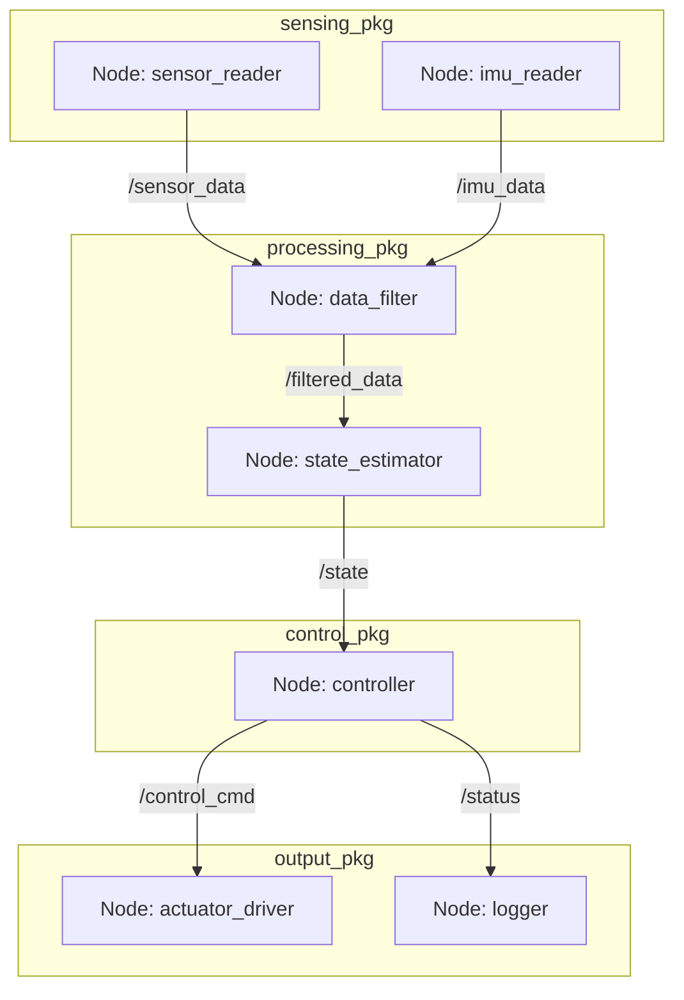

Nodes are subprograms in an application, responsible for only one thing. Nodes communicate with each other through topics, services, and parameters. Like OOP, nodes reduce code **complexity**, and provide low **fault tolerance**. Even further, nodes can be written in **many different programming languages** including Python and C++. Nodes should have a single purpose while communicating each nodes.

In ros2, a package is an independent unit in an application. packages contain nodes, enabling inter-package communication.



### Write code for nodes. (Python)

```python
#!/usr/bin/env python3
import rclpy
from rclpy.node import Node


class MyNode(Node):
    def __init__(self):
        super().__init__("py_test")  # Create a node
        self.get_logger().info("Hello world")  # Logging with the node
        # Run timer_callback every 1 second.
        self.create_timer(1.0, self.timer_callback)

    def timer_callback(self):
        self.get_logger().info("Hello")


def main(args=None):
    rclpy.init(args=args)

    node = MyNode()
    rclpy.spin(node)  # makes the node keep running

    rclpy.shutdown()

if __name__ == "__main__":
    main()
```

### Install a node to a package.

```python
from setuptools import find_packages, setup

package_name = 'my_py_pkg'

setup(
    name=package_name,
    version='0.0.0',
    packages=find_packages(exclude=['test']),
    data_files=[
        ('share/ament_index/resource_index/packages',
            ['resource/' + package_name]),
        ('share/' + package_name, ['package.xml']),
    ],
    install_requires=['setuptools'],
    zip_safe=True,
    maintainer='jj',
    maintainer_email='jj@todo.todo',
    description='TODO: Package description',
    license='TODO: License declaration',
    extras_require={
        'test': [
            'pytest',
        ],
    },
    ''' Where I've changed '''
    entry_points={
        'console_scripts': [
            "py_node = my_py_pkg.my_first_node:main"  # node_name = path_to_py_file:function_name
        ],
    },
)
```
*setup.py*

and run below so that you can

```bash
colcon build --packages-select my_py_pkg  # Build with a node
source ./install/setup.bash  # Run setup.bash whenever finished building.
ros2 run my_py_pkg py_node
```

You should see output similar to the following.
```bash
[INFO] [1764994343.482507922] [py_test]: Hello world
```

**NOTE: py_test is a "node name" and py_node is an "execution name". Node name is defined in the node Python code, and excution name is defined in the setup.py file**

**NOTE: Remember that below commands should be run every time the code for the node is fixed.**<br>
```bash
colcon build --packages-select my_py_pkg
source ./install/setup.bash
ros2 run my_py_pkg my_node
```

### Write code for nodes. (C++)

```cpp
#include "rclcpp/rclcpp.hpp"

class MyNode : public rclcpp::Node{
public:
    MyNode() : Node("cpp_test"), counter_(0)
    {
        RCLCPP_INFO(this->get_logger(), "Hello world");
        timer_ = this->create_wall_timer(
            std::chrono::seconds(1),
            std::bind(&MyNode::timerCallback, this)
        );
    }
private:
    void timerCallback(){
        RCLCPP_INFO(this->get_logger(), "Hello %d", counter_);
        counter_++;
    }
    rclcpp::TimerBase::SharedPtr timer_;
    int counter_;
};

int main(int argc, char **argv){
    rclcpp::init(argc, argv);

    auto node = std::make_shared<MyNode>();
    rclcpp::spin(node);

    rclcpp::shutdown();
    return 0;
}
```

```
cmake_minimum_required(VERSION 3.8)
project(my_cpp_pkg)

if(CMAKE_COMPILER_IS_GNUCXX OR CMAKE_CXX_COMPILER_ID MATCHES "Clang")
  add_compile_options(-Wall -Wextra -Wpedantic)
endif()

# find dependencies
find_package(ament_cmake REQUIRED)
find_package(rclcpp REQUIRED)

# Where I've changed
add_executable(cpp_node src/my_first_node.cpp)
ament_target_dependencies(cpp_node rclcpp)

install(TARGETS
  cpp_node
  DESTINATION lib/${PROJECT_NAME}
)

ament_package()
```
*my_cpp_pkg/CMakeLists.txt*
